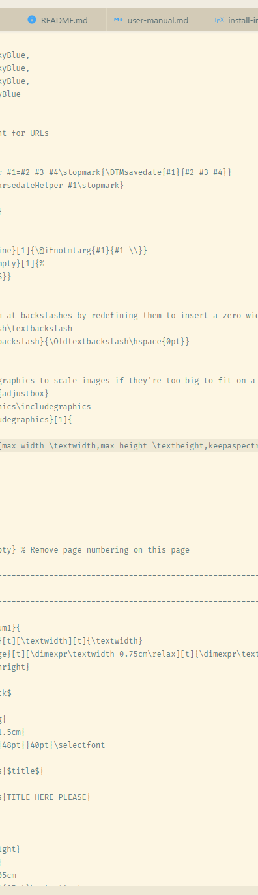

# Sample Document

Amet adipisicing ut non veniam consectetur ad laboris et dolor velit mollit labore sunt. Id
voluptate voluptate est consectetur sit amet non aute commodo. Cillum non id mollit esse enim
exercitation eiusmod fugiat ex elit eu commodo commodo in. Consequat labore ea sint quis sit laboris
magna cupidatat magna veniam cillum laborum ipsum voluptate.


Do non eiusmod reprehenderit est adipisicing excepteur ex tempor eu laboris aliqua minim consectetur
quis. Magna exercitation adipisicing consectetur dolore eu. Lorem dolore ullamco esse amet ut
laboris occaecat proident sit.


Eu incididunt aliquip aute culpa culpa ea reprehenderit. Anim dolore sunt excepteur ea ut magna nisi
esse aliqua dolor ullamco. Laborum fugiat eu quis minim occaecat fugiat nulla officia commodo eu
velit nisi labore. Qui sit exercitation consectetur fugiat excepteur voluptate consectetur ad irure
ad sint reprehenderit est Lorem. Sit quis quis elit adipisicing excepteur sint qui. Et voluptate
dolore incididunt adipisicing cupidatat esse enim culpa nostrud anim laboris aliqua duis.



Incididunt voluptate quis dolore dolore voluptate incididunt. Aliqua minim ad consectetur excepteur
laboris est ad labore. Proident dolore amet esse eiusmod non adipisicing est. Voluptate amet ullamco
nisi reprehenderit aute in duis. `Lorem do quis consectetur` aliquip ullamco eiusmod nulla id
incididunt.

```make
################################################################################
#
# LaTeX/PDF setup
#
DOCUMENT_TEX    := ${DOCUMENT:.md=.tex}
DOCUMENT_PDF    := ${DOCUMENT:.md=.pdf}
TEX_TEMPLATE    := default.latex
PANDOC_TEX_OPTS := $(PANDOC_COMMON_OPTS) --standalone --number-sections --listings --table-of-contents --variable=papersize:a4 --variable=fontsize:12pt --variable=documentclass:article --variable=classoption:final --variable=classoption:titlepage --variable=mainfont:Cambria --variable=sansfont:Calibri '--variable=monofont:Lucida Console' '--variable=monofontoptions:Scale=0.75' --variable=linkcolor:DarkSkyBlue --variable=citecolor:DarkSkyBlue --variable=filecolor:DarkSkyBlue --variable=toccolor:DarkSkyBlue --variable=urlcolor:DarkSkyBlue --variable=linestretch:1.2 --template=$(TEX_TEMPLATE)
PANDOC_PDF_OPTS := $(PANDOC_TEX_OPTS) --pdf-engine xelatex
%.tex : %.md; pandoc $< -o $@ $(PANDOC_TEX_OPTS)
%.pdf : %.md; pandoc $< -o $@ $(PANDOC_PDF_OPTS)
.PHONY: tex
tex: $(DOCUMENT_TEX)
.PHONY: pdf
pdf: $(DOCUMENT_PDF)
$(DOCUMENT_PDF) $(DOCUMENT_TEX): $(TEX_TEMPLATE)
```

Ad proident culpa ipsum ipsum cillum sunt ut qui eiusmod dolore ex id Lorem. In sunt tempor aute
commodo sunt in commodo quis enim dolore aliquip exercitation nisi. Cupidatat ut laboris sit do
minim labore ullamco ea.

Dolor ea ipsum non non nostrud nostrud officia. Duis laboris sit nostrud dolor ullamco officia
voluptate dolore id qui est. Nulla ut eu nostrud amet et irure elit aliquip labore et dolore
commodo. Incididunt do velit magna culpa labore irure esse. Aliquip ut officia Lorem ut voluptate ex
in tempor commodo est nulla.

## Sample PlantUML Diagram


